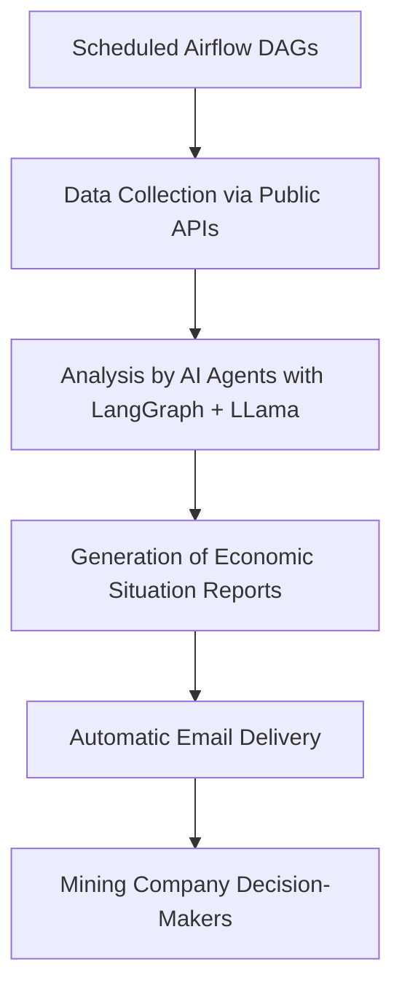

# AI Multi-Agents Project
# 📊 Macro Pipeline: Automated Macroeconomic Analysis with Airflow, Docker, and LangGraph (LLama)

This project implements an **automated data pipeline** to collect, analyze, and send reports on **relevant macroeconomic indicators** (GDP, Inflation, Exchange Rate, and Interest Rates) using:

- **Apache Airflow** (orchestration)
- **Docker** (isolated and reproducible environment)
- **LangGraph with LLama** (AI agents for automated analysis)

The goal is to **support strategic decision-making for a mining company** with up-to-date information and AI-generated analyses.

---

## ⚙️ Features

1. **Data Collection via Public APIs (Bacen, IBGE)**
   - Automated collection of indicators after their respective releases.

2. **Analysis with LangGraph + LLama Agents**
   - Each indicator is analyzed by a specialized AI agent based on a local LLM (LLama).

3. **Automated Report Generation**
   - Textual reports are generated with insights for decision-making.

4. **Email Delivery**
   - Reports are automatically sent to decision-makers.

---

## 🔁 Pipeline Flow (Diagram)

---

## 🏁 Conclusions

The implementation of this automated macroeconomic analysis pipeline brings several concrete benefits to organizations, especially in data-driven sectors like mining:

- **Cost Reduction:** By automating data collection, analysis, and reporting, the need for manual labor and specialized consultants is reduced, leading to significant operational cost savings.
- **Process Optimization:** The integration of Airflow, Docker, and AI agents streamlines workflows, ensuring timely and accurate delivery of information to decision-makers.
- **More Informed Decisions:** Up-to-date, AI-analyzed macroeconomic reports empower executives to make better strategic choices, reducing business risks related to economic volatility.
- **Scalability and Reproducibility:** The containerized and orchestrated approach allows easy scaling and adaptation to other sectors or additional indicators, maximizing the return on investment.
- **Error Minimization:** Automated processes reduce human error, increasing the reliability of analyses and reports.

In summary, this pipeline not only modernizes the way organizations consume macroeconomic data but also contributes directly to greater efficiency, agility, and competitiveness.
